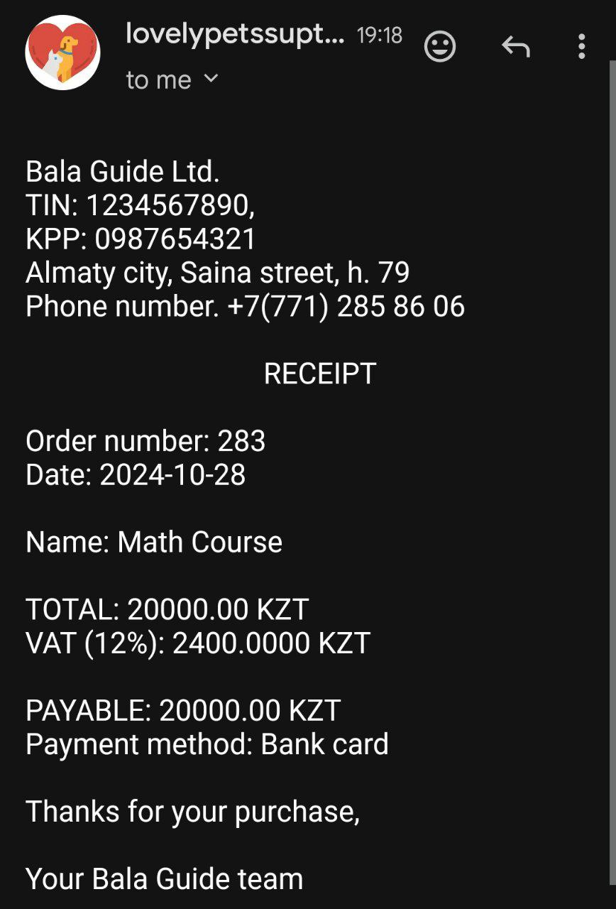

# Bala Guide

## Overview
The online platform for registering children for courses and sections is designed to simplify and optimize the search and enrollment process. Parents will be able to easily find and choose suitable courses for their children
## Table of Contents

- [Project Structure](#project-structure)
- [Updates](#Updates)
- [Access the DataBase](#access-the-dataBase)
- [DataBase](#dataBase)

## Project Structure

```bash
BalaGuide/
├── src/
│   ├── main
│   ├── java/org/khatep/balaguide/
│   │   │   │   ├── aop/
│   │   │   │   │   └── annotations/
│   │   │   │   │   │   └── ForLog
│   │   │   │   │   └── LoggingAspect
│   │   │   │   ├── config/
│   │   │   │   │   └── KafkaConfiguration
│   │   │   │   ├── dbinit/
│   │   │   │   │   └── DatabaseInitializer
│   │   │   │   ├── exceptions/
│   │   │   │   │   ├── ChildNotBelongToParentException
│   │   │   │   │   ├── CourseFullException
│   │   │   │   │   ├── IneligibleChildException
│   │   │   │   │   └── InsufficientFundsException
│   │   │   │   ├── kafka/
│   │   │   │   │   └── consumer/
│   │   │   │   │   │   └── EmailConsumer
│   │   │   │   │   └── producer/
│   │   │   │   │   │   └── EmailProducer
│   │   │   │   ├── menu/
│   │   │   │   │   └── MenuPrinter
│   │   │   │   ├── models/
│   │   │   │   │   └── dto/
│   │   │   │   │   │   └── CourseDto
│   │   │   │   │   └── entities/
│   │   │   │   │   │   ├── Child
│   │   │   │   │   │   ├── Course
│   │   │   │   │   │   ├── EducationCenter
│   │   │   │   │   │   ├── Parent
│   │   │   │   │   │   ├── Receipt
│   │   │   │   │   │   └── Teacher
│   │   │   │   │   └── enums/
│   │   │   │   │   │   ├── Category
│   │   │   │   │   │   ├── Colors
│   │   │   │   │   │   ├── Gender
│   │   │   │   │   │   └── PaymentMethod
│   │   │   │   ├── repositories/
│   │   │   │   │   ├── ChildRepository
│   │   │   │   │   ├── CourseRepository
│   │   │   │   │   ├── EducationCenterRepository
│   │   │   │   │   ├── ParentRepository
│   │   │   │   │   └── TeacherRepository
│   │   │   │   ├── services/
│   │   │   │   │   └── impl/
│   │   │   │   │   │   ├── ChildServiceImpl
│   │   │   │   │   │   ├── CourseServiceImpl
│   │   │   │   │   │   ├── ParentServiceImpl
│   │   │   │   │   │   └── ReceiptServiceImpl
│   │   │   │   │   ├── ChildService
│   │   │   │   │   ├── CourseService
│   │   │   │   │   ├── ParentService
│   │   │   │   │   └── ReceiptService
│   │   │   │   └── BalaGuideApplication.java
│   ├── resources/
│   │   │   │  └── application.properties
├── .gitignore
├──  pom.xml
└── README.md
```
## Updates

### `Receipt` entity
- **Purpose**: save and send receipts to parents
### `ReceiptRepository` 
### `ReceiptService`
- **Methods**:
  - `createReceipt`
<br></br>
### `CourseDto`
- **Purpose**: encapsulates the details of a course, including its name and price.
<br></br>

### `KafkaConfiguration`
- **Purpose**: creating a new topic and kafkaTemplate bean
### `EmailProducer`
- **Purpose**: sends receipt messages to the Kafka `receipt` topic. It uses Kafka to publish these messages, which can then be used by consumers
### `EmailConsumer`
- **Purpose**: listens for `receipt` messages from a Kafka topic and sends an email receipt to the parent who made the purchase.



<br></br>
### `ChildServiceImplTest`
- **Purpose**: Testing the functionality of the Child Service Impl class, ensuring that the methods work correctly
### `CourseServiceImplTest`
- **Purpose**: Testing the functionality of the Course Service Impl class, ensuring that the methods work correctly
### `ReceiptServiceImplTest`
- **Purpose**: Testing the functionality of the Receipt Service Impl class, ensuring that the methods work correctly

Total coverage: 92%
<br></br>
## Access the DataBase
   - Open your web browser and go to `http://localhost:8081/h2-console` to access the H2 console.
   - Use the following credentials to log in:
     - **JDBC URL**: `jdbc:h2:mem:testdb`
     - **Username**: `sa`
     - **Password**: *(leave blank)*

## DataBase

### Enums
- **Gender Enum**: This enum defines two possible values for gender—'MALE' and 'FEMALE'. It is used in the `teacher` and `child` tables to categorize individuals accordingly.
- **Category Enum**: This enum encompasses various educational categories, including 'PROGRAMMING', 'SPORT', 'LANGUAGES', 'ART', and 'MATH'. It is applied in the `course` table to classify courses.

## Tables

### 1. Education Center
- **Table Name**: `education_center`
- **Purpose**: Stores information about educational institutions offering courses. Key attributes include the center's name, creation date, contact information, and social media links.

### 2. Course
- **Table Name**: `course`
- **Purpose**: Contains details about the courses available at education centers. Attributes include course name, description, category (linked to the Category Enum), pricing, and participant details. It also establishes a foreign key relationship with the `education_center` table to associate each course with a specific center.

### 3. Teacher
- **Table Name**: `teacher`
- **Purpose**: Captures information about teachers, including their personal details and gender. This table allows for managing teachers who conduct courses.

### 4. Parent
- **Table Name**: `parent`
- **Purpose**: Manages parent information, including contact details and account credentials. This table supports features related to parent accounts and their interaction with courses.

### 5. Child
- **Table Name**: `child`
- **Purpose**: Holds data regarding children enrolled in courses. Each child can be linked to a parent via a foreign key, allowing for structured access to parental information.

### 6. Receipt
- **Table Name**: `receipt`
- **Purpose**: Stores information about payments for courses. It also includes foreign keys that link it to a parent table (indicating who made the payment) and a course table (indicating which course the payment was made for). This table allows you to track the history of payments and ensures that the courses are linked to the corresponding transactions.
  
### 7. Teacher-Course Relationship
- **Table Name**: `teacher_course`
- **Purpose**: Establishes a many-to-many relationship between teachers and courses, allowing multiple teachers to be associated with multiple courses. This is essential for course management and instructor assignments.

### 8. Child-Course Relationship
- **Table Name**: `child_course`
- **Purpose**: Facilitates a many-to-many relationship between children and courses, enabling tracking of which children are enrolled in which courses.


